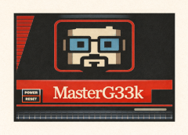
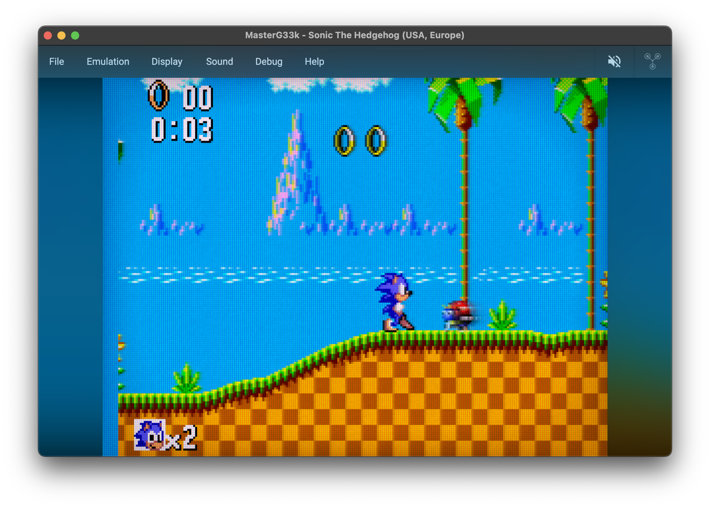
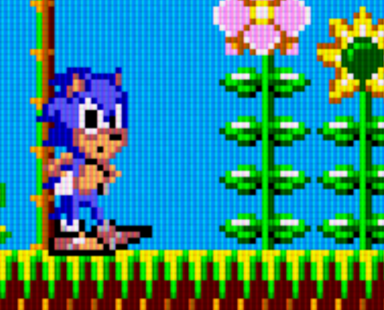

  

# MasterG33k
A cross-platform Avalonia-based Sega Master System emulator.

## CRT close-up

## Purpose
After building a [ZX Spectrum emulator](https://github.com/deanthecoder/ZXSpeculator) and a [Game Boy emulator](https://github.com/deanthecoder/G33kBoy), I wanted to keep the childhood tour going.  
The Sega Master System was next, and MasterG33k is my way of learning its hardware properly, starting from a clean Z80 implementation.

## Keyboard controls

### Master System pad
Global key hooks translate the following keys into the SMS joypad:

| Keyboard       | Joypad |
|----------------|--------|
| `Arrow keys`   | D-pad |
| `Z`            | Button 1 |
| `X`            | Button 2 |
| `A`            | Auto-fire Button 1 |
| `S`            | Auto-fire Button 2 |
| `P`            | Pause |

### Application shortcuts
- **Open ROM**: `Ctrl+O` (`Cmd+O` on macOS)
- **Start/stop recording**: `Ctrl+M` (`Cmd+M` on macOS)
- **Reset console**: `Ctrl+R` (`Cmd+R` on macOS)

## Emulator features
- **ROM loading from ZIPs** – Load standard `.sms` ROMs directly, or from a `.zip` archive containing a Master System ROM. Drag-and-drop is supported.
- **CRT emulation** – Optional CRT-style rendering including scanlines, phosphor glow, and grain.
- **Motion blur** – Frame blending in CRT mode to simulate persistence of vision.
- **Ambient blur background** – Optional blurred background so the game screen stands out while the app blends into your desktop.
- **PAL/NTSC timing** – Toggle between 50Hz and 60Hz timing at runtime.
- **Screenshot capture** – Save the current frame as a TGA screenshot.
- **Movie recording** – Capture the CRT-filtered output with synced audio to an MP4 file.
- **Hardware-style low-pass filter** – Optional audio filter that emulates analog output rolloff.

## Status
- ✔ Z80 CPU core (instruction-complete)
- ✔ Mode 4 VDP bring-up and scanline renderer
- ✔ PSG 4-channel audio
- ✔ CRT/LCD-style visual effects
- ✔ Recording and screenshots

## Highlights
- **Z80 accuracy** – `DTC.Z80` implements the CPU, memory bus, disassembler, and core devices.
- **Shared core utilities** – `DTC.Core` provides commands, extensions, converters, and Avalonia helpers shared across projects.
- **Avalonia UI shell** – `MasterG33k` hosts the emulator in a cross-platform desktop window.
- **Validation suite** – `UnitTests` target the Z80 core and VDP renderer via NUnit to catch regressions.

## Useful links
- [Z80 CPU User Manual (UM0080)](https://www.zilog.com/docs/z80/um0080.pdf)
- [CLR Home opcode tables](https://clrhome.org/table/)
- [Codeslinger Master System project](http://www.codeslinger.co.uk/pages/projects/mastersystem.html)
- [SMS Power! Development Wiki](https://www.smspower.org/Development)
- [SMS Power! PSG documentation](https://www.smspower.org/Development/PSG)
- [SMS Power! VDP documentation](https://www.smspower.org/Development/VDP)
- [JavaGear (Zophar)](https://www.zophar.net/java/sms-gg/javagear.html)

## License
Licensed under the MIT License. See [LICENSE](LICENSE) for details.
